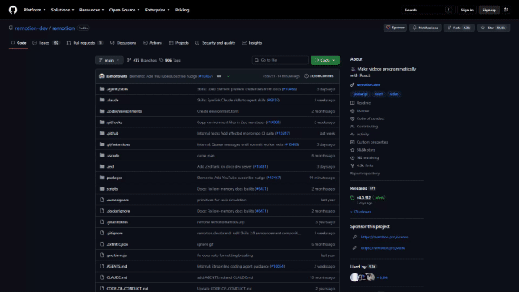
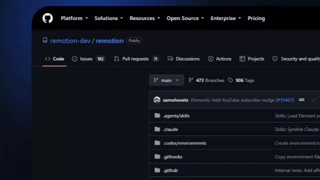

# web2remotion

`web2remotion` 用自然语言把真实 GitHub 页面效果整理成可确认的剪辑表，再用 Remotion 生成效果预览。

## 安装

```powershell
git clone https://github.com/jaikensai888/web2remotion.git
cd web2remotion
npm install
```

## 使用方法

把下面的请求交给 `web2remotion` skill：

```text
请使用 web2remotion 规划一个真实 GitHub 页面演示。

素材 URL：https://github.com/remotion-dev/remotion
镜头 1（0～5 秒）：镜头平滑移动到仓库 title（remotion），然后以 title 为中心放大 3 倍。

请先输出剪辑表和对应效果预览，等待我确认，不要直接执行整片渲染。
```

AI 会先生成剪辑表。确认内容无误后，回复“确认，按此表执行”；如果需要修改，可以直接调整镜头时间、目标区域或效果强度。

本地查看效果目录：

```powershell
start effect-catalog/preview.html
```

只渲染当前效果：

```powershell
$env:EFFECT_ID = "camera-zoom"
npm run effects:render
npm run effects:verify
```

## Use Cases / 使用场景

### 1. 镜头平滑到仓库 title，并放大 3 倍

`effectId`: `camera-zoom`

可直接复制的提示词：

```text
使用真实 GitHub 页面录制作为主素材，镜头先保持完整仓库首页，然后平滑移动并锁定到仓库 title（remotion），再以 title 为中心连续放大到 3 倍；保持真实页面清晰，不重绘网页内容。
```



该 GIF 使用真实 GitHub 页面录制生成，是单个效果预览，不是最终整片。

### 2. 2 倍静止平面透视倾斜

`effectId`: `perspective-tilt`

可直接复制的提示词：

```text
使用真实 GitHub 页面录制作为主素材，直接以约 2 倍大小的网页平面开始，让 repository title（仓库名称）清晰可见；页面保持静止不滚动；再在这个 2 倍平面上进行 X/Y 轴旋转、透视变形和缓慢运镜。
```



该 GIF 使用真实 GitHub 页面录制生成，是单个效果预览，不是最终整片。
